 # iOS Pipeline
 1. Download [Xcode](https://itunes.apple.com/us/app/xcode/id497799835?ls=1&mt=12)
 2. Create project from Xcode Wizard **or** Clone project [ios-pipeline](https://github.com/nortonpmjr/ios-pipeline)
 4. Open FizzBuzz project


 ## Important Websites
 * [Itunes Connect](https://appstoreconnect.apple.com)
 * [Apple Developer](https://developer.apple.com/account/#/overview/27F3ZKLUK9)
    
## Basics of Build
 1. Click at the arrow button Build and Run
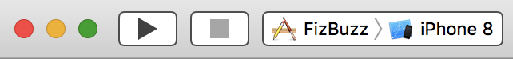

# Requirements

## **Create an App ID**
1. Access Apple Developer
2. Click on account 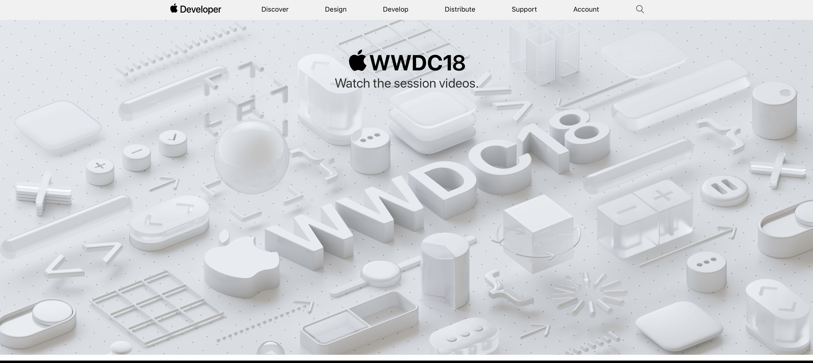  
3. Click on Certificates, IDs & Profiles 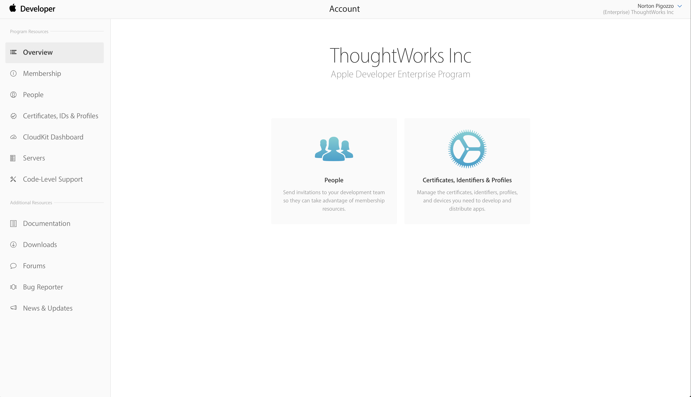
4. Click on App ID 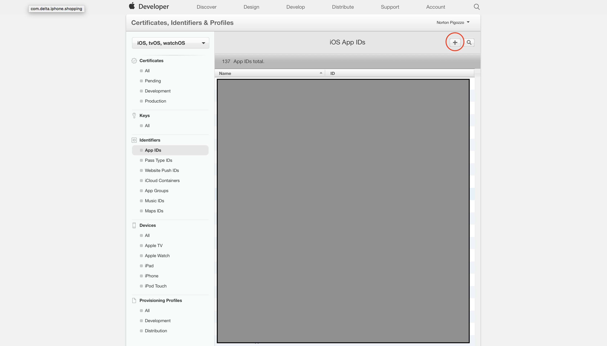
5. Enter a name or description  
6. Select Explicit App ID and adds your bundle id  
7. Continue *App Services can be left with default options*
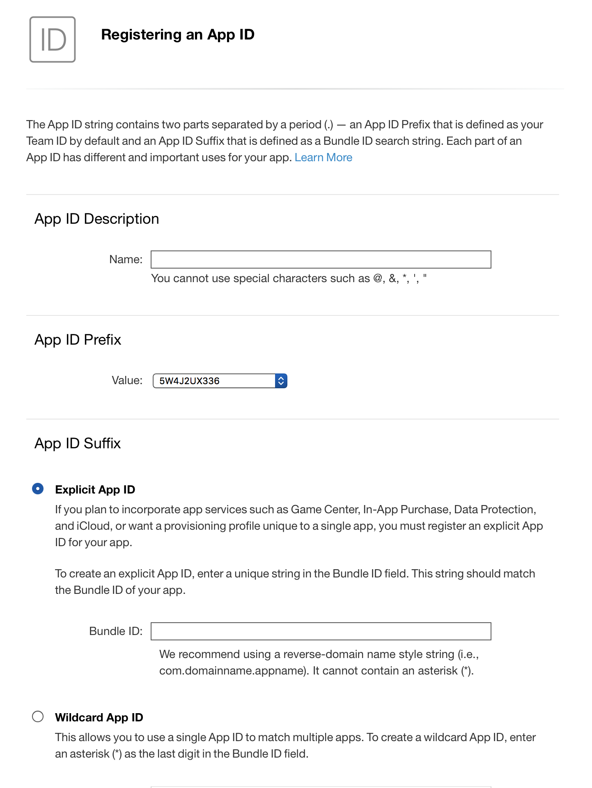  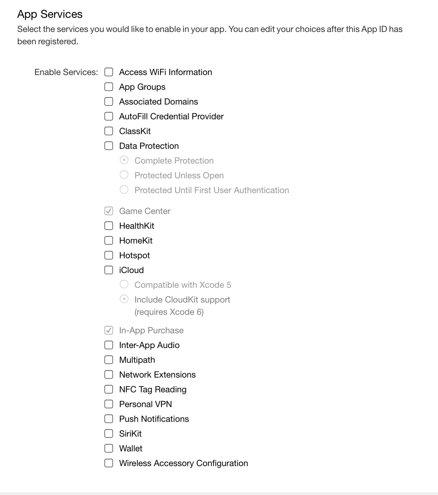

## [**App Signing**](https://help.apple.com/xcode/mac/current/#/dev3a05256b8)

Code signing (or signing) an app allows the system to identify who signed the app and to verify that the app has not been modified since it was signed.

The operating system verifies the signature of apps downloaded from the App Store to ensure that apps with invalid signatures don’t run. An app’s executable code is protected by its signature because the signature becomes invalid if any of the executable code in the app bundle changes. A valid signature lets users trust that the app was signed by an Apple source and hasn’t been modified since it was signed.


## **Certificates**

*Xcode uses your signing certificate to sign your app during the build process. The signing certificate consists of a public-private key pair and a certificate. The private key is used by cryptographic functions to generate the signature. The certificate is issued by Apple; it contains the public key and identifies you as the owner of the key pair. In order to sign apps, you must have both parts of your signing certificate, and an Apple certificate authority in your keychain.*

1. iOS App Development  
2. Follow CSR instructions  
3. Download and keep it safe  

* **Development Certificates: Belong to individuals and one iOS Development or Mac Development is allowed per Mac.**  
* **Distribution Certificates: belongs to the team and is required for publishing Apps. To share signing certificate with another person on the team you need to export it. On the other person’s Mac, double-click the exported file to install the signing certificate in the keychain.**

## **Provisioning Profile**
1. Click on Provisioning Profile Development
2. Add
3. In House
4. Select the App ID you previously created  

* **Once you’ve create an App ID and a distribution certificate you can create an iOS provisioning profile for distributing your application through the App Store.**  
* **You need a provisioning profile for each type of distribution: Ad Hoc, App Store, In House.**

# Deployment
1. Acess iTunes Connect  
2. Go to My Apps  
3. Select or create a new app  
4. Provide the requested informations (name, bundleID)
5. Go to Prepare for submission  
6. Once you upload an binary and it finishes processing you have to select it here, to send it to the review process

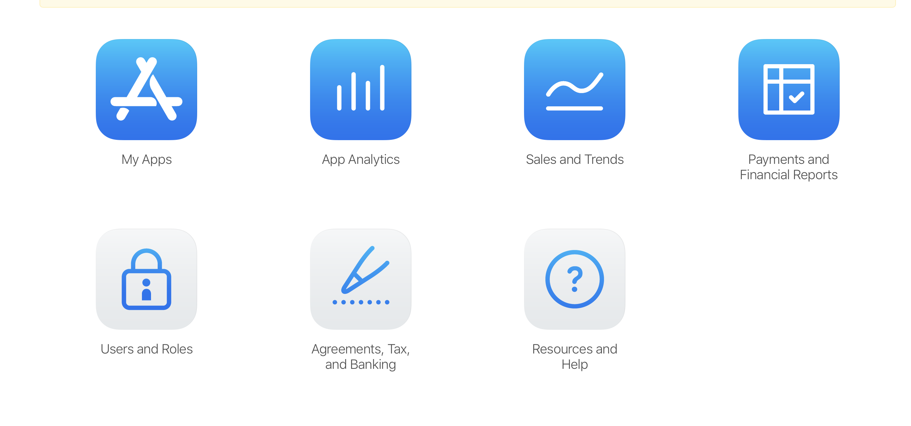
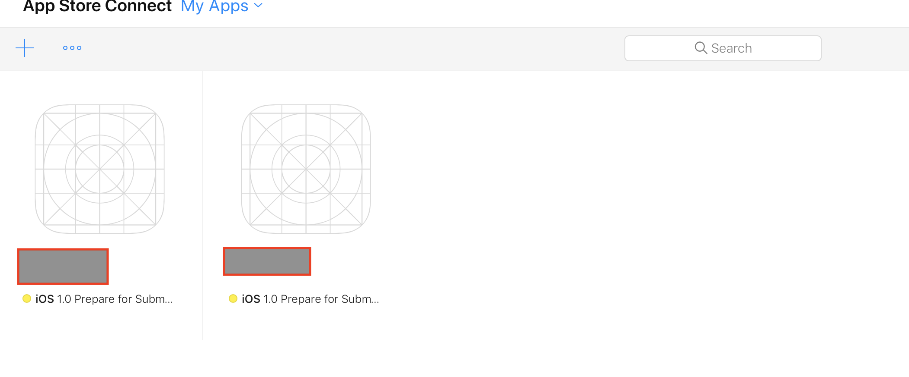
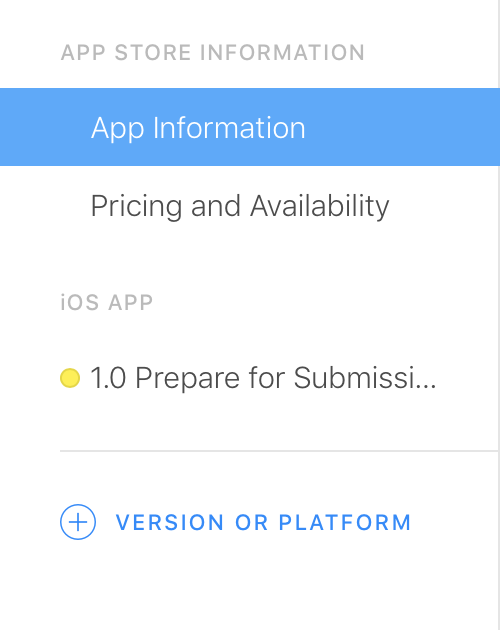
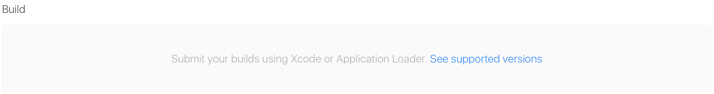

# Testing
    
##  Unit Testing
    
1.  Open ViewControllerUnitTests file and make the test fail
    
    ```
    func testMoveScore() {
        viewController.play(move: Move.Number)
        let newScore = viewController.gameScore!
        XCTAssertEqual(newScore, 3)
    }
    ```

    * Corret the test and run again
    
2. Run the tests clicking at the diamond button on the left
    
## UI Testing
1. Open ViewControllerUITests and make the test fail

    ```
    func testTapNumberScore() {
        let numberButton = app.buttons["numberButton"]
        
        numberButton.tap()
        let newScore = numberButton.label
        XCTAssertEqual(newScore, "3")
    }
    ```

    * Correct the test and run again

2. Run the tests clicking at the diamond button on the left

# Automation

## [Fastlane](https://docs.fastlane.tools) Install
_Fastlane is the easiest way to automate beta deployments and releases for your iOS and Android apps._

### **Files Definition**
***

The [Appfile](https://docs.fastlane.tools/advanced/Appfile/) stores useful information that are used across all fastlane tools like your Apple ID or the application Bundle Identifier, to deploy your lanes faster and tailored on your project needs. 

The [Fastfile](https://docs.fastlane.tools/advanced/Fastfile/) stores the automation configuration that can be run with fastlane.

### **Summary**
***

iOS deployment requires several tedious tasks, and error prone.  
_Fastlane_ automate this tasks through ruby code, allowing it to be extended from pure ruby functions if needed, and a swift support it being developed. 

It's possible to import actions from other files or repository, allowing for greater customization.  
Since ```fastlane``` can be executed from CLI, other tools can access it's lanes, providing power to CI/CD pipelines to handle Code Signing, Testflight upload, Testing, Crashlytics uploading, Report generation with simple commands.

Notifications can be sent with the execution results, improving team communication and project visualization. Source control manipulation like updating version number, changelogs, plist files, and store descriptions.

### **Hands On**
***

Create a fastfile, by running ```fastlane init``` in your repository root and paste the code below:

```
lane :beta do
    test
    increment_build_number
    build_app
    upload_to_testflight  # Archive, validate and upload the binary to Testflight
end

lane :release do
    test
    capture_screenshots
    build_app
    upload_to_app_store       # Upload the screenshots and the binary to iTunes
    slack                     # Let your team-mates know the new version is live
end

lane :test do
    cocoapoads                                       # Install pods from podfile
    swiftlint(output_file: "swiftlint.result.json", 
      reporter: "json", 
      ignore_exit_status: true)                      # Outputs swiftlint report
    scan                                             # Execute test suite
end
```

* List of fastlane available [actions](https://docs.fastlane.tools/actions/).

    
## Linter
### [Swiftlint](https://github.com/realm/SwiftLint)
_A tool to enforce Swift style and conventions, loosely based on GitHub's Swift Style Guide. Supported by Realm_

Local install for automation use: ```brew install swiftlint```

Integrate SwiftLint into an Xcode scheme to get warnings and errors displayed in the IDE. Just add a new "Run Script Phase" with:
```
if which swiftlint >/dev/null; then
  swiftlint
else
  echo "warning: SwiftLint not installed, download from https://github.com/realm/SwiftLint"
fi
```

# Jenkins

## Install
## Configuration

# Travis CI

## Register
[Sign in](https://travis-ci.org) with github account

## Requirements
* Repository must be hosted at [github](www.github.com) and be public **OR** pay for another plan.

## Configuration
Select the repository you want to create a pipeline.
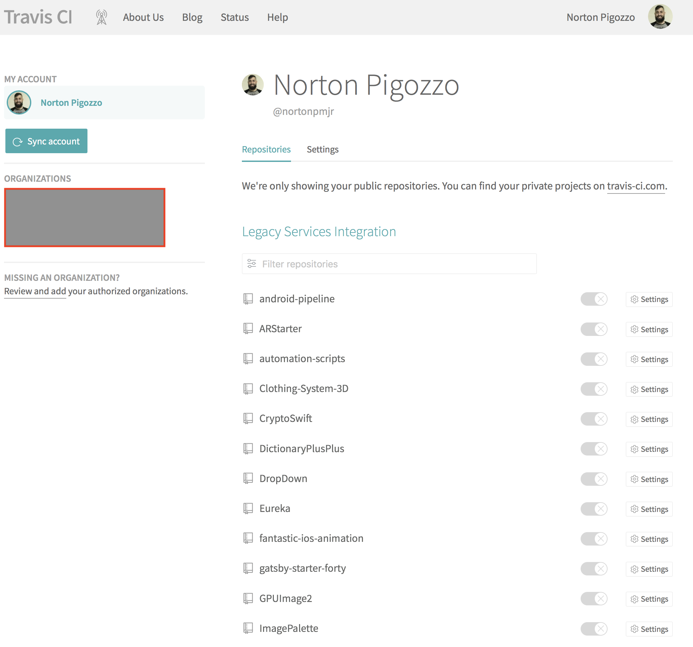

Create a .travis.yml file at your root folder.
Copy and paste  
**os**: Defines

```
os: osx
branches:
  only:
    - master

before_install:
 - gem install fastlane  --no-ri --no-rdoc --no-document

script:
 - cd FizBuzz && fastlane test
```


# CLI Commands

## **xcodebuild**
* List available sdks  
    `` xcodebuild -showsdks``  

* List available destinations  
    ``xcodebuild -project ios-pipeline.xcodeproj -scheme ios-pipeline -showdestinations``  

* Clean and test  
    ``xcodebuild -project ios-pipeline.xcodeproj -scheme ios-pipeline -destination "platform=iOS Simulator,name=iPhone 8,OS=11.4" clean test``

# TODO

## Automate Changelog
## Test Report
 
***
# References

* [How to submit to App Store](https://code.tutsplus.com/tutorials/how-to-submit-an-ios-app-to-the-app-store--mobile-16812)
* [Certificates Documentation](https://help.apple.com/xcode/mac/current/#/dev154b28f09)
* [Danger and Swiftlint](https://medium.com/developermind/using-swiftlint-and-danger-for-swift-best-practices-48432e4e268a)
* [Danger](https://danger.systems/js/swift.html)
* [Xcodebuild from CLI](https://medium.com/xcblog/xcodebuild-deploy-ios-app-from-command-line-c6defff0d8b8)
* [Jenkins + Fastlane](http://thebugcode.github.io/ios-continous-integration-choosing-a-build-server-and-tooling/)
* [How to export “in-house”](https://medium.com/wso2-iot/how-to-export-in-house-developed-ios-app-as-an-enterprise-application-dc087bdd64c3)
* [Xcode Help](https://help.apple.com/xcode/mac/current/#/devc8c2a6be1)

